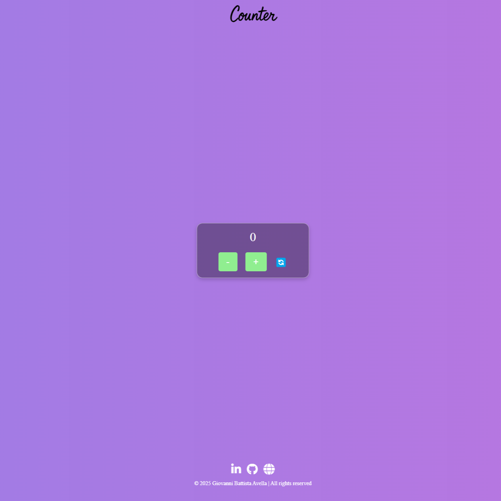

# Counter in JavaScript

Un semplice Counter scritto in JavaScript, che si avvia automaticamente al completo caricamento del DOM. Il codice è strutturato in due sezioni principali:

- Manipolazione del DOM: crea dinamicamente la struttura HTML del counter, inclusi il display e i pulsanti di incremento/decremento.

- Funzioni Logiche: gestisce la logica di incremento e decremento del valore del counter.


# Funzionamento

Alla creazione del counter:

- Viene inizializzata la costante "counterValue".

- La funzione CreateCounter genera la struttura HTML e la inserisce nel DOM.

- I pulsanti + e - permettono di modificare il valore del counter con un click.
  

# Struttura del Progetto

```
Counter/Public
├── assets/
│   ├── css/
│   │   ├── style.css
│   │   └── style.map.css
│   ├── js/
│   │   └── script.js
│   └── scss/
│       └── style.scss
└── index.html
README.md
```


# Installazione e Utilizzo

### Opzione 1: Esegui Localmente

Clona o scarica questo repository.

Apri index.html in un browser.

### Opzione 2: Usa un Live Server

Se stai usando VS Code, puoi installare l'estensione "Live Server" e avviare index.html direttamente.


# Screenshot



# Personalizzazione

Puoi modificare il CSS per cambiare l'aspetto del counter.

Puoi estendere la logica con limiti minimi/massimi o animazioni.

# Licenza

Questo progetto è rilasciato sotto la MIT License. Puoi modificarlo e adattarlo alle tue esigneze
